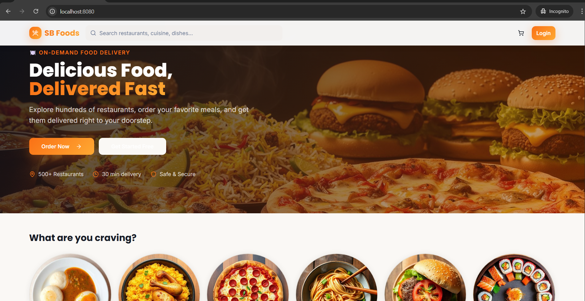
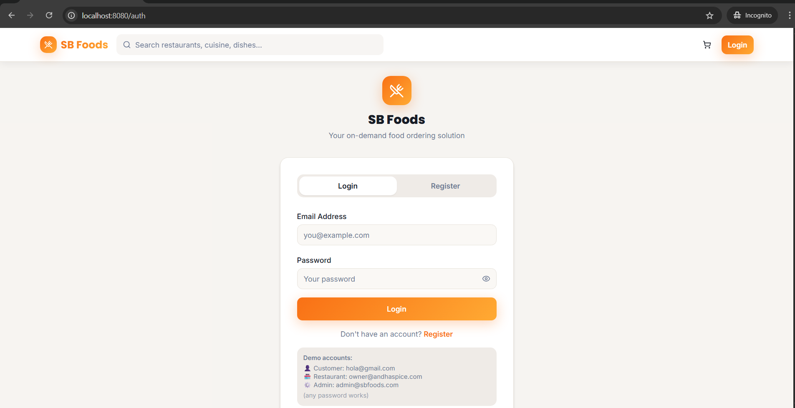
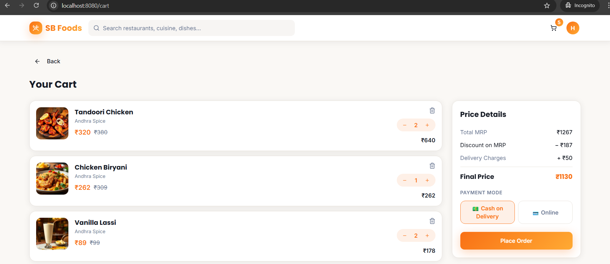
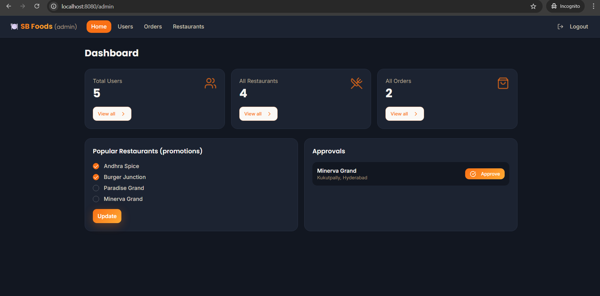

# 🍔 SB Foods – OrderOnTheGo

A Full-Stack MERN Food Ordering Application that allows users to browse food items, add them to cart, and place orders online. The platform includes User, Restaurant, and Admin dashboards for complete food management.

---

## 📌 Project Overview

SB Foods (OrderOnTheGo) is a modern food ordering web application built using the MERN stack (MongoDB, Express.js, React.js, Node.js).  

It simplifies the online food ordering process and provides a seamless experience for customers, restaurants, and administrators.

---

## 🌍 Live Demo

🔗 **Demo Link:** https://your-demo-link-here.com

---

## 🖼️ Project Screenshots

### 🏠 Home Page


### 🔐 Login Page


### 🛒 Cart Page


### 🛡️ Admin Dashboard


> 📌 Create a folder named **images** inside your project and upload screenshots there.

---

## 🚀 Features

- 👤 User Registration & Login
- 🛒 Add to Cart & Place Orders
- 📦 Order History Tracking
- 🍽️ Restaurant Product Management
- 🛡️ Admin Dashboard
- ⚡ Real-Time Order Confirmation

---

## 🛠️ Tech Stack

- Frontend: React.js
- Backend: Node.js, Express.js
- Database: MongoDB
- Authentication: JWT
- Version Control: Git & GitHub

---

## 📂 Project Structure

```
Food-Ordering-App-MERN/
│
├── client/
│   ├── src/components
│   ├── src/pages
│
├── server/
│   ├── models
│   ├── routes
│   ├── controllers
│
└── README.md
```

---

## ⚙️ Installation & Setup

### 1️⃣ Clone the Repository

```
git clone https://github.com/sambasivagudala369/Smartinternz1
cd Smartinternz1
```

### 2️⃣ Install Dependencies

```
npm install
```

### 3️⃣ Start the Server

```
npm run dev
```

### 4️⃣ Open in Browser

```
http://localhost:3000
```

---

## 👤 Application Flow

### User Flow
Register → Login → Browse Products → Add to Cart → Place Order → View Orders  

### Restaurant Flow
Login → Add/Edit Food Items  

### Admin Flow
Login → Manage Users → Manage Orders → Manage Products  

---

## 🎯 Future Enhancements

- 💳 Online Payment Integration
- 📍 Live Order Tracking
- 🔔 Push Notifications
- ⭐ Ratings & Reviews

---
